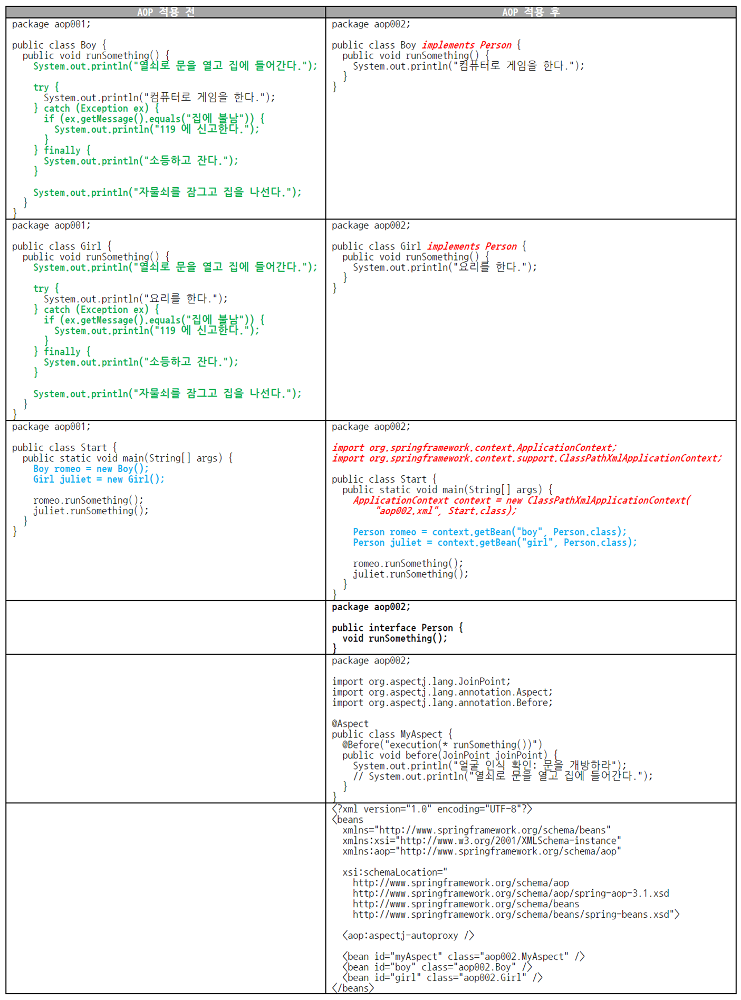

# Week 05

## 범위

- 7장. 스프링 삼각형과 설정 정보

## 학습 내용

- 스프링 이해의 필수: **POJO** 기반 + **스프링 삼각형**(IoC/DI, AOP, PSA) = 스프링의 3대 프로그래밍 모델
- 스프링 프레임워크 : 스프링 삼각형 = 영어 문장 : 알파벳

### 7-1. IoC/DI - 제어의 역전/의존성 주입

#### 의존성 = new

```pseudo
운전자가 자동차를 생산한다.
자동차는 내부적으로 타이어를 생산한다.
```

```java
new Car();
Car 객체 생성자에서 new Tire();
```

- **의존성은 new다.**
- new를 실행하는 Car와 Tire 사이에서 **Car가 Tire에 의존**한다.
- 의존하는 객체(전체) ↔ 의존되는 객체(부분)
  - **집합 관계**: 부분이 전체와 다른 생명 주기 가능. Ex) 집 vs. 냉장고
  - **구성 관계**: 부분은 전체와 같은 생명 주기. Ex) 사람 vs. 심장
- => 전체가 부분에 의존, 프로그래밍에서 의존 관계는 new로 표현됨

| 노트 | 대응 코드 |
|---|---|
| 자동차는 타이어에 의존한다 | `Car` 생성자의 `tire = new KoreaTire();` |
| 운전자는 자동차를 사용한다 | `Driver`의 `car.getTireBrand()` |
| 운전자가 자동차에 의존한다고 봐도 된다 | `Driver`의 `Car car = new Car();` |
| 자동차의 생성자 코드에서 tire 속성에 새로운 타이어를 생성해서 참조 | `Tire tire;` + `Car()` 안의 `tire = new KoreaTire();` |

```java
// Car.java
public class Car {
    Tire tire;

    public Car() {
        tire = new KoreaTire(); // 자동차가 타이어를 생산(new) → Car가 Tire에 의존
        // tire = new AmericaTire();
    }

    public String getTireBrand() {
        return "장착된 타이어: " + tire.getBrand();
    }
}
```

```java
// Driver.java
public class Driver {
    public static void main(String[] args) {
        Car car = new Car();  // 운전자가 자동차를 생산 → Driver가 Car에 의존
        System.out.println(car.getTireBrand());  // 운전자는 자동차를 사용
    }
}
```

- 의존 흐름: **Driver → Car → Tire(KoreaTire)**
- 핵심: Car가 어떤 타이어를 쓸지 **스스로 new로 결정** → 다음 예제부터 new를 밖으로 빼서 주입(DI)

#### 스프링 없이 의존성 주입하기1 - 생성자를 통한 의존성 주입

```java
// 외부에서 생산된 tire 객체를 Car 생성자의 인자 주입으로 해결
Tire tire = new KoreaTire();  // 운전자가 타이어를 생산한다.
Car car = new Car(tire);  // 운전자가 자동차를 생산하면서 타이어를 장착한다.
```

- **주입** = 외부에서
  - 자동차 내부에서 타이어를 생산하는 것 X → 외부에서 생산된 타이어를 자동차에 장착하는 작업 O
- **생성자 주입**: 외부에서 생산된 tire 객체를 Car 생성자의 인자로 전달
- new를 통해 타이어를 생산하는 부분: Car.java -> Driver.java

```java
// Car.java
public class Car {
    Tire tire;

    public Car(Tire tire) {   // 생성자의 인자로 tire 주입
        this.tire = tire;
    }

    public String getTireBrand() {
        return "장착된 타이어: " + tire.getBrand();
    }
}

// Driver.java
public class Driver {
    public static void main(String[] args) {
        Tire tire = new KoreaTire();   // 또는 new AmericaTire()
        Car car = new Car(tire);       // 생산된 tire 객체 참조 변수를 Car 생성자의 인자로 전달
        System.out.println(car.getTireBrand());
    }
}
```

- Tire(인터페이스) ← KoreaTire, AmericaTire (implements)

- 장점
  - 차량을 생성할 때: 자동차는 어떤 타이어를 장착할까 고민 X, 운전자가 어떤 타이어를 장착할까 고민 O
- 결론
  - 기존 방식: Car는 KoreaTire, AmericaTire에 대해 정확히 알고 있어야만 객체 생성 가능
  - 의존성 주입: Car는 그저 **Tire 인터페이스를 구현한 어떤 객체**가 들어오기만 하면 정상 작동
  - **확장성**: ChinaTire, JapanTire, EnglandTire 등 새로운 타이어 브랜드가 생겨도 Tire 인터페이스를 구현한다면 Car.java 변경 X, 다시 컴파일 X
  - 모듈 분리: Car.java, Tire.java | Driver.java, KoreaTire.java, AmericaTire.java
    - 새로운 ChinaTire.java가 생겨도 Driver.java, ChinaTire.java만 컴파일해서 배포
    - => 재컴파일과 재배포에 대한 부담 덜 수 있음 -> 인터페이스를 구현 했기에 얻는 이점(표준화)
  - 현실 세계의 표준 규격 준수 = 프로그래밍 세계의 인터페이스 구현

#### 스프링 없이 의존성 주입하기2 - 속성을 통한 의존성 주입

- 전략 패턴의 3요소
  - 전략: Tire를 구현한 KoreaTire, AmericaTire
  - 컨텍스트: Car의 getTireBrand() 메서드
  - 클라이언트: Driver의 main() 메서드

```java
Tire tire = new KoreaTire();  // 운전자가 타이어를 생산한다.
Car car = new Car();  // 운전자가 자동차를 생산한다.
car.setTire(tire);  // 운전자가 자동차에 타이어를 장착한다.
```

- 생성자를 통한 의존성 주입의 문제: 자동차를 생산할 때 한번 타이어를 장착하면 더 이상 타이어를 교체 장착할 방법 X -> 운전자가 원할 때 Car의 Tire를 교체
- 어노테이션(@)을 사용하는 경우 주로 속성 주입 방식을 사용

```java
// Car.java
public class Car {
    Tire tire;

    public Tire getTire() {           // tire 속성의 getter
        return tire;
    }

    public void setTire(Tire tire) {  // tire 속성의 setter: 여기로 의존성 주입
        this.tire = tire;
    }

    public String getTireBrand() {
        return "장착된 타이어: " + tire.getBrand();
    }
}

// Driver.java
public class Driver {
    public static void main(String[] args) {
        Tire tire = new KoreaTire();
        Car car = new Car();          // 타이어 없이 자동차 먼저 생산
        car.setTire(tire);            // setter로 타이어 장착

        System.out.println(car.getTireBrand());

        car.setTire(new AmericaTire());  // 필요하면 언제든 타이어 교체 가능
        System.out.println(car.getTireBrand());
    }
}
```

- Car 클래스에서 생성자가 사라짐. 자바 컴파일러가 기본 생성자를 제공
- tire 속성의 get/set 속성 메서드가 보임
- 마지막 두 줄처럼 setTire()를 다시 호출하면 생성자 주입에선 불가능했던 **타이어 교체** 가능

#### 스프링 없이 의존성 주입 - XML 파일 사용

```java
ApplicationContext context = new ClassPathXmlApplicationContext("expert002.xml", Driver.class);
Tire tire = (Tire)context.getBean("tire");  // 운전자가 종합 쇼핑몰에서 타이어를 구매한다.
Car car = (Car)context.getBean("car");  // 운전자가 종합 쇼핑몰에서 자동차를 구매한다.
car.setTire(tire);  // 운전자가 자동차에 타이어를 장착한다.
```

- 스프링: 생성자를 통한 의존성 주입 + 속성을 통한 의존성 주입 모두 지원 (여기서는 속성을 통한 의존성 주입만)
- 의사 코드: 생산 -> 구매로 달라졌을 뿐 나머지는 바뀌지 않음
- 작업: Driver 클래스만 살짝 손봐주고 + 스프링 설정 파일 하나만 추가
- 종합 쇼핑몰(안 파는 것 없고, 없는 것 없는 초대형 종합 쇼핑몰) 역할 = 스프링 프레임 워크
- 직접 생산 -> 종합 쇼핑몰을 통해 구매 -> 현실 세계와 더욱 유사해짐
- Driver.java: 생산 과정 -> 구매 과정 (상품을 구매할 종합 쇼핑몰에 대한 정보가 필요하기 때문)
- 입점된 상품에 대한 정보 : XML 파일

```xml
<?xml version="1.0" encoding="UTF-8"?>
<beans xmlns="http://www.springframework.org/schema/beans"
	xmlns:xsi="http://www.w3.org/2001/XMLSchema-instance"
	xsi:schemaLocation="http://www.springframework.org/schema/beans 
		http://www.springframework.org/schema/beans/spring-beans.xsd">

	<bean id="tire" class="expert002.KoreaTire"></bean>

	<bean id="americaTire" class="expert002.AmericaTire"></bean>

	<bean id="car" class="expert002.Car"></bean>

</beans>
```

```java
// Driver.java (실제 코드)
public class Driver {
    public static void main(String[] args) {
        // 종합 쇼핑몰(스프링 컨테이너)에 입점 정보(XML)를 알려줌
        ApplicationContext context = new ClassPathXmlApplicationContext("expert002/expert002.xml");

        Car car = context.getBean("car", Car.class);     // 자동차 구매
        Tire tire = context.getBean("tire", Tire.class); // 타이어 구매

        car.setTire(tire);                               // 타이어 장착 (속성 주입)

        System.out.println(car.getTireBrand());
    }
}
```

- 스프링 도입의 가장 큰 이득 : 타이어 브랜드 변경 시 재컴파일/재배포 X, **XML 파일만 수정**하면 실행 결과 변경

#### 스프링을 통한 의존성 주입 - @Autowired를 통한 속성 주입

```java
// Car라고 하는 클래스에 tire라고 하는 속성을 만들고 설정자 메서드 만들기
Tire tire;

public void setTire(Tire tire) {
    this.tire = tire;
}
```

```java
// 창조적 게으름(C&I)
import org.springframework.beans.factory.annotation.Autowired;

@Autowired
Tire tire;
```

- @Autowired 의미: 스프링 설정 파일을 보고 자동으로 속성의 설정자 메서드에 해당하는 역할을 해주겠다.

```xml
<!-- 기존 XML 설정 파일 -->
<bean id="car" class="expert003.Car">
    <property name="tire" ref="koreaTire"></property>
</bean>
```

```xml
<!-- 새로운 XML 설정 파일 -->
<bean id="car" class="expert004.Car"></bean>
```

- property 태그가 사라진 이유: @Autowired로 car의 property를 자동으로 엮어줌(자동 의존성 주입) -> 생략 가능

```java
// expert004/Car.java
public class Car {
    @Autowired
    Tire tire;   // setTire() 없음

    public String getTireBrand() {
        return "장착된 타이어: " + tire.getBrand();
    }
}
```

- 자바 코드에서 달라진 부분
    - Car.java - @Autowired를 사용하도록 바뀜
    - Driver.java - 변경된 부분 없음. 필요하다면 Car도 Driver 클래스의 속성으로 뽑아낸 후 @Autowired를 이용하도록 바꾸면 됨
    - expert.xml - 앞에서 다룸

#### 번외 1. AmericaTire로 변경된 Driver.java를 실행하려면 어디를 고쳐야 할까?

- 재컴파일 X, expert.xml에서 bean의 id 속성만 변경

```xml
<bean id="tire02" class="expert004.KoreaTire"></bean>
<bean id="tire" class="expert004.AmericaTire"></bean>
```

#### 번외 2. 위에서 KoreaTire 부분을 완전히 삭제하고 AmericaTire의 id 속성을 삭제

- Driver.java를 실행하면 정상적으로 구동
- 의문: 기존에는 @Autowired가 지정된 tire 속성과 bean의 id 속성이 일치하는 것을 찾아 매칭시킨 것 같았는데, id 속성이 없는데 어떻게 매칭?
    - 인터페이스 구현 여부(type). 같은 타입을 구현한 클래스가 여러 개 있다면 그때 bean 태그의 id로 구분해서 매칭

```text
기존 설정
Car.java | @Autowired Tire tire;
expert.xml | <bean id="tire" class="expert004.AmericaTire"></bean>

아래와 같이 작성해도 제대로 매칭
Car.java | @Autowired Tire tire;
expert.xml | <bean class="expert004.AmericaTire"></bean>
AmericaTire.java | public class AmericaTire implements Tire
```

- @Autowired를 통한 속성 매칭 규칙

```text
type을 구현한 빈이 있는가? -> 아니오: No matching bean 에러
빈이 한 개인가? -> 아니오
    id가 일치하는 하나의 빈이 있는가? -> 아니오: No unique bean 에러
=> 유일한 빈을 객체에 할당
```

- 예시 (공통: `Car.java | @Autowired Tire tire;`)

| 케이스 | expert.xml | 결과 | 비고 |
|---|---|---|---|
| 같은 type 빈 2개 + id 일치 | `<bean id="tire" class="expert004.KoreaTire">`<br>`<bean id="wheel" class="expert004.KoreaTire">` | KoreaTire로 잘 작동 | 같은 타입이 여러 개면 id로 구분 |
| id 불일치 + 빈 1개 | `<bean id="wheel" class="expert004.KoreaTire">` | 잘 작동 | @Autowired는 id 매칭보다 type 매칭이 우선 |
| id는 일치하지만 type이 다른 빈(Door) | `<bean class="expert004.KoreaTire">`<br>`<bean id="tire" class="expert004.Door">` | KoreaTire가 잘 매칭 | id와 type 중 type 구현에 우선순위 |

```java
// Door.java
package expert004;
public class Door { }
```

#### 스프링을 통한 의존성 주입 - @Resource를 통한 속성 주입

- @Autowired는 스프링의 어노테이션 : type과 id 가운데 매칭 우선순위는 type이 높다
- @Resource는 자바 표준 어노테이션 : type과 id 가운데 매칭 우선순위는 id가 높다, id로 매칭할 빈을 찾지 못한 경우, type으로 매칭할 빈을 찾게 된다

#### 스프링을 통한 의존성 주입 - @Autowired vs. @Resource vs. `<property>` 태그

- @Autowired, @Resource 어노테이션: 두 객체 사이에 의존성을 해결

**@Autowired와 @Resource 비교**

| 구분 | @Autowired | @Resource |
|---|---|---|
| 출처 | 스프링 프레임워크 | 표준 자바 |
| 소속 패키지 | org.springframework.beans.factory.annotation.Autowired | javax.annotation.Resource |
| 빈 검색 방식 | byType 먼저, 못 찾으면 byName | byName 먼저, 못 찾으면 byType |
| 특이사항 | @Qualifier("") 협업 | name 어트리뷰트 |
| byName 강제하기 | `@Autowired @Qualifier("tire1")` | `@Resource(name="tire1")` |

```java
// expert006/Car.java - 세 가지 방식 (하나만 활성화)
import javax.annotation.Resource;
import org.springframework.beans.factory.annotation.Autowired;
import org.springframework.beans.factory.annotation.Qualifier;

public class Car {
    @Resource(name = "tire1")   // byName 강제하기
    // @Autowired
    // @Qualifier("tire2")      // @Autowired + @Qualifier = byName 강제하기
    Tire tire;

    public String getTireBrand() {
        return "장착된 타이어: " + tire.getBrand();
    }
}
```

#### 사례 1. XML 설정 - 한 개의 빈이 id 없이 tire 인터페이스를 구현한 경우

```xml
<!-- expert006.xml (<context:annotation-config /> 포함) -->
<bean class="expert006.KoreaTire"></bean>
<bean id="car" class="expert006.Car"></bean>
```

```java
// Car.java - @Resource를 이용한 tire 속성 주입
@Resource
Tire tire;
```

```java
// Car.java - @Autowired를 이용한 tire 속성 주입
@Autowired
Tire tire;
```

- Driver.java 실행: 두 경우 모두 아무 문제 없이 실행

#### 사례 2. XML 설정 - 두 개의 빈이 id 없이 tire 인터페이스를 구현한 경우

```xml
<!-- expert006.xml -->
<bean class="expert006.KoreaTire"></bean>
<bean class="expert006.AmericaTire"></bean>
<bean id="car" class="expert006.Car"></bean>
```

- @Resource와 @Autowired의 경우 Driver.java를 실행할 때 오류 메시지
    - 같은 type의 빈이 2개인데 id로도 구분되지 않음 -> `NoUniqueBeanDefinitionException`

#### 사례 3. XML 설정 - 두 개의 빈이 tire 인터페이스를 구현하고 하나가 일치하는 id를 가진 경우

```xml
<!-- expert006.xml -->
<bean id="tire" class="expert006.KoreaTire"></bean>
<bean id="tire2" class="expert006.AmericaTire"></bean>
<bean id="car" class="expert006.Car"></bean>
```

- @Resource의 경우 Driver.java를 실행했을 때 정상적으로 작동
    - 장착된 타이어: 코리아 타이어
- @Autowired의 경우 Driver.java를 실행할 때 정상적으로 작동
    - 장착된 타이어: 코리아 타이어

#### 사례 4. XML 설정 - 두 개의 빈이 tire 인터페이스를 구현하고 일치하는 id가 없는 경우

```xml
<!-- expert006.xml -->
<bean id="tire1" class="expert006.KoreaTire"></bean>
<bean id="tire2" class="expert006.AmericaTire"></bean>
<bean id="car" class="expert006.Car"></bean>
```

- @Resource와 @Autowired의 경우 Driver.java를 실행할 때 오류 메시지
    - 같은 type의 빈이 2개인데 id(tire)와 일치하는 빈이 없음 -> `NoUniqueBeanDefinitionException`

#### 사례 5. XML 설정 - 일치하는 id가 하나 있지만 인터페이스를 구현하지 않은 경우

```xml
<!-- expert006.xml -->
<bean id="tire" class="expert006.Door"></bean>
<bean id="car" class="expert006.Car"></bean>
```

```java
// Door.java
package expert006;
public class Door { }
```

- @Resource와 @Autowired의 경우 Driver.java를 실행할 때 오류 메시지
    - @Resource: id가 tire인 빈(Door)은 찾지만 Tire 타입이 아님 -> `BeanNotOfRequiredTypeException`
    - @Autowired: Tire 타입의 빈이 없음 -> `NoSuchBeanDefinitionException`

- byName 우선인 @Resource / byType 우선인 @Autowired -> 에러 메시지가 서로 다름에 주목

- 사례 연구 결론: @Autowired와 @Resource를 바꿔서 사용하는 데 크게 차이가 없음
- @Autowired: 자동으로 주입된다는 의미에서 명확
- @Resource: 실제 Car 입장에서 보면 더 어울리는 표현
- 스프링이 아닌 다른 프레임워크로 교체되는 경우 대비 -> 자바 표준인 @Resource가 유리
- @Resource는 사실 `<bean>` 태그의 자식 태그인 `<property>` 태그로 해결될 수 있음
- `<property>`: XML 파일만 봐도 DI 관계를 손쉽게 확인 / 프로젝트 규모가 커지면 XML 파일의 규모도 커짐 -> XML 파일도 용도별로 분리 가능
- 개발 생산성은 @Resource가 더 나음, `<property>`는 유지보수성이 좋음

- @Autowired와 @Resource 중에서는 @Resource
- @Resource와 `<property>` 중에서는 `<property>`
- 다수의 클래스를 만들고 의존 관계를 지정하다 보면 유지보수에 무관한 관계 -> @Resource
- 유지보수와 밀접하거나 자주 변경되는 관계 -> `<property>`

- 의존 관계가 new로 단순화했던 부분 -> 사실 변수에 값을 할당하는 모든 곳에 의존 관계가 생김
    - 대입 연산자에 의해 변수에 값이 할당되는 순간에 의존 발생
    - 변수가 지역 변수이건 속성이건, 할당되는 값이 리터럴이건 객체이건 의존은 발생
    - 의존 대상이 내부에 있을 수도 있고 외부에 있을 수도 있음
- DI: 외부에 있는 의존 대상을 주입하는 것
- 의존 대상을 구현하고 배치할 때: SOLID, 응집도는 높이고 결합도는 낮추라는 기본 원칙에 충실 -> 프로젝트의 구현과 유지보수가 수월해짐

### 7-2. AOP - Aspect? 관점? 핵심 관심사? 횡단 관심사?

- AOP : Aspect-Oriented Programming, 관점 지향 프로그래밍
- 스프링 DI = 의존성(new)에 대한 주입 / 스프링 AOP = 로직(code) 주입
- 횡단 관심사: 다수의 모듈에 공통적으로 나타나는 부분
    - Ex) 입금, 출금, 이체 모듈에서 로깅, 보안, 트랜잭션 기능이 반복적으로 나타남
- 데이터베이스 연동 프로그램: insert, update, delete, select 연산이든 항상 반복해서 등장하는 다음과 같은 형태의 코드

```pseudo
DB 커넥션 준비
Statement 객체 준비

try {
    DB 커넥션 연결
    Statement 객체 세팅
    insert / update / delete / select 실행
} catch ... {
    예외 처리
} catch... {
    예외 처리
} finally {
    DB 자원 반납
}
```

- 코드 = 핵심 관심사 + 횡단 관심사
- 핵심 관심사: 모듈별로 다름 / 횡단 관심사: 모듈별로 반복되어 중복해서 나타나는 부분
- "반복/중복은 분리해서 한 곳에서 관리하라" -> 그런데 AOP는 더욱 진보된 방법 사용

- 객체 지향에서 로직(코드)이 있는 곳 = 메서드의 안쪽 -> 메서드에서 코드를 주입할 수 있는 곳은 몇 군데일까?
    - Around(메서드 전 구역)
    - Before(메서드 시작 직후)
    - After(메서드 종료 직전)
    - AfterReturning(메서드 정상 종료 후)
    - AfterThrowing(메서드에서 예외가 발생하면서 종료된 후)

```java
// Person.java
package aop002;

public interface Person {
    void runSomething();
}
```

- Person 인터페이스를 구현하도록 Boy.java를 변경. 횡단 관심사를 모두 지움.

```java
// Boy.java
package aop002;

public class Boy implements Person {
    public void runSomething() {
        System.out.println("컴퓨터로 게임을 한다.");
    }
}
```

- 횡단 관심사를 지워서 단순해짐. 핵심 관심사만 남음.
- 개발: 한 개의 Boy.java를 4개의 파일로 분할해서 개발하는 수고 / 추가 개발과 유지보수 관점: 무척이나 편한 코드
- AOP를 적용하면서 Boy.java에 단일 책임 원칙(SRP)을 자연스럽게 적용

```java
// MyAspect.java
package aop002;

import org.aspectj.lang.JoinPoint;
import org.aspectj.lang.annotation.Aspect;
import org.aspectj.lang.annotation.Before;

@Aspect
public class MyAspect {
    @Before("execution(* runSomething())")
    public void before(JoinPoint joinPoint) {
        System.out.println("얼굴 인식 확인: 문을 개방하라");
        // System.out.println("열쇠로 문을 열고 집에 들어간다.");
    }
}
```

- @Aspect: 이 클래스를 이제 AOP에서 사용하겠다는 의미
- @Before: 대상 메서드 실행 전에 이 메서드를 실행하겠다는 의미
- JoinPoint: @Before에서 선언된 메서드인 aop002.Boy.runSomething()을 의미

```java
@Before("execution(public void aop002.Boy.runSomething())")
```

```java
@Before("execution(* runSomething())")
```

- 코드를 고쳐서 실행해도 잘 동작 -> Girl.java의 runSomething() 메서드도 @Before를 통해 같은 로직을 주입해 줄 수 있다는 것을 의미



- Boy.java와 Girl.java에서 초록색 부분이 사라진 이유는?
    - 횡단 관심사이기 때문
- Boy.java와 Girl.java에서 붉은색 부분이 추가된 이유는?
    - 스프링 AOP가 인터페이스 기반으로 작동하기 때문에 그 요건을 충족하기 위해서
- Start.java에서 파란색 부분이 변경된 이유는?
    - Start.java에서 붉은색(import, 컨텍스트 생성) 부분은 스프링 프레임워크를 적용, 파란색(getBean) 부분은 활용하는 부분
- Person.java가 새롭게 나온 이유?
    - 스프링 AOP가 인터페이스 기반이기 때문
- MyAspect.java가 들어온 이유?
    - Boy.java와 Girl.java에서 공통적으로 나타나는 횡단 관심사를 모두 삭제했지만 결국 누군가는 횡단 관심사를 처리해야 함
- 빈이 설정되는 이유: 객체의 생성과 의존성 주입을 스프링 프레임워크에 위임하기 위해서
- 스프링 프레임워크: 객체 생성뿐 아니라 객체의 생명주기 전반에 걸쳐 빈의 생성에서 소멸까지 관리
    - boy 빈, girl 빈: AOP 적용 대상이기에 등록할 필요
    - myAspect 빈: AOP의 Aspect이기에 등록할 필요
- `<aop:aspectj-autoproxy />`: 스프링 프레임워크에게 AOP 프록시를 사용하라고 알려주는 지시자
    - j = 자바, auto = 자동, proxy = 횡단 관심사를 핵심 관심사에 주입하는 것

- 스프링 AOP는 프록시를 사용
    - 호출하는 쪽에서나 호출당하는 쪽, 그 누구도 프록시가 존재하는지조차 모름. 스프링 프레임워크만 프록시의 존재를 앎.
    - 버퍼, 캐시 서버도 일종의 프록시

- 스프링 AOP의 핵심
    - 인터페이스 기반
    - 프록시 기반
    - 런타임 기반

#### Pointcut - 자르는 시점? Aspect 적용 위치 지정자!

```java
// MyAspect.java
@Aspect
public class MyAspect {
    @Before("execution(* runSomething())")   // * runSomething() = Pointcut
    public void before(JoinPoint joinPoint) {
        System.out.println("얼굴 인식 확인: 문을 개방하라");
    }
}
```

- *runSomething()이 Pointcut
- @Before("execution(*runSomething())"): 지금 선언하고 있는 메서드(public void before)를 *runSomething 메서드가 실행되기 전에 실행하라는 의미
- Pointcut = 횡단 관심사를 적용할 타깃 메서드를 선택하는 지시자 = 타깃 클래스의 타깃 메서드 지정자
- 다른 AOP 프레임워크: 메서드뿐만 아니라 속성 등에서 Aspect를 적용할 수 있음 -> Aspect 적용 위치 지정자가 맞는 표현, 메서드 선정 알고리즘이라고도 함
- `접근제한자패턴? 리턴타입패턴 패키지&클래스패턴.메서드이름패턴(파라미터패턴) throws예외패턴?` (`?` = 생략 가능)

#### JoinPoint - 연결점? 연결 가능한 지점!

- Pointcut은 JoinPoint의 부분 집합

- 스프링 AOP: 인터페이스 기반 (인터페이스 = 추상 메서드의 집합체) -> 메서드에만 적용 가능
- Pointcut의 후보가 되는 모든 메서드들 = JoinPoint, Aspect 적용이 가능한 지점
    - -> JoinPoint란 Aspect 적용이 가능한 모든 지점
    - = Aspect를 적용할 수 있는 지점 중 일부가 Pointcut이 되므로 Pointcut은 JoinPoint의 부분집합
- JoinPoint란 스프링 프레임워크가 관리하는 빈의 모든 메서드에 해당

- JoinPoint 파라미터로 실행 시점에 확인 가능한 정보
    - 실제 호출된 메서드가 무엇인지
    - 실제 호출된 메서드를 소유한 객체가 무엇인지
    - 호출된 메서드의 파라미터는 무엇인지 등

- 광의의 JoinPoint: Aspect 적용이 가능한 모든 지점
- 협의의 JoinPoint: 호출된 객체의 메서드

#### Advice - 조언? 언제, 무엇을!

- Advice: pointcut에 적용할 로직, 메서드 + 언제라는 개념까지 포함
    - => Advice란 Pointcut에 언제, 무엇을 적용할지 정의한 메서드, 타깃 객체의 타깃 메서드에 적용될 부가 기능

#### Aspect - 관점? 측면? Advisor의 집합체!

- Aspect = Advice들 + Pointcut들
- 여러 개의 Advice와 여러 개의 Pointcut의 결합체를 의미하는 용어
- Advice는 [언제, 무엇을] + Pointcut은 [어디에] = Aspect는 [언제, 어디에, 무엇을]

#### Advisor - 조언자? 어디서, 언제, 무엇을?

- Advisor = 한 개의 Advice + 한 개의 Pointcut
- 스프링 AOP에서만 사용, 이제는 쓰지 말라고 권고(Aspect가 나왔기 때문)

### 7-3. PSA - 일관성 있는 서비스 추상화

- JDBC: 서비스 추상화의 예
    - 표준 스펙이 있기에 Connection, Statement, ResultSet을 이용해 공통된 방식으로 코드를 작성할 수 있음
    - 데이터베이스 종류에 관계없이 같은 방식으로 제어할 수 있는 이유 = 어댑터 패턴을 활용했기 때문
    - -> 어댑터 패턴을 적용해 같은 일을 하는 다수의 기술을 공통의 인터페이스로 제어할 수 있게 한 것 = 서비스 추상화
- OXM 기술: 다양한 기술이 있고, 기술들이 제공하는 API는 제각각
    - 스프링은 제각각인 API를 위한 어댑터를 제공 -> 실제로 어떤 OXM 기술을 쓰든 일관된 방식으로 코드를 작성할 수 있게 지원
    - 하나의 OXM 기술에서 다른 OXM 기술로 변경할 때 큰 변화 없이 세부 기술을 교체해서 사용할 수 있게 해줌
- 서비스 추상화 + 일관성 있는 방식 제공 = PSA
- 스프링 OXM뿐만 아니라 ORM, 캐시, 트랜잭션 등 다양한 기술에 대한 PSA를 제공함
